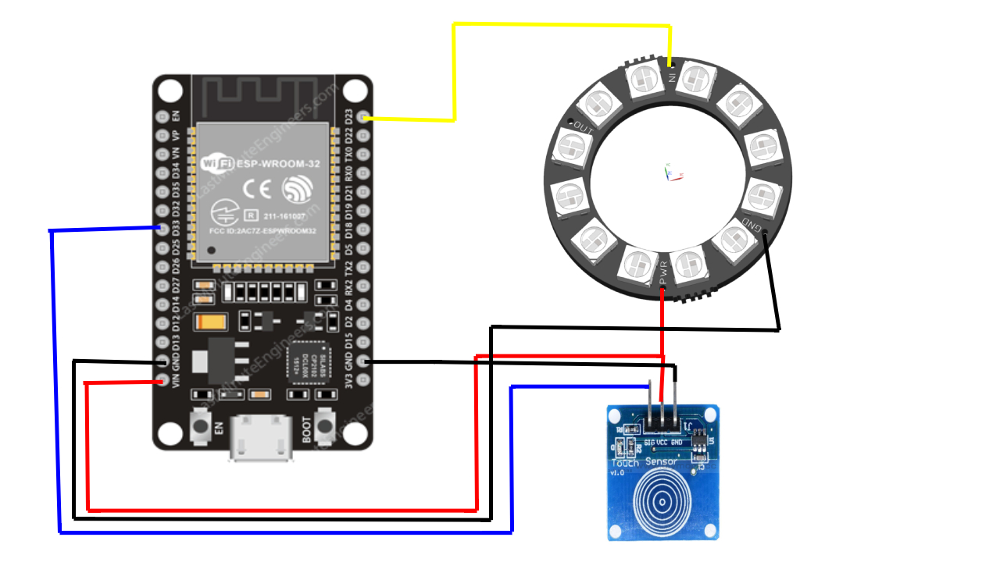

## Description
An RGB lamp that is controlled by web server and touch sensor.

## Hardware
WS2812B 24 LED, ESP32, TTP223 Touch Sensor

## Pin Layout

| ESP pin  | To |
| ------------- | ------------- |
| VIN  | WS2812 PWR and TTP233 VCC  |
| GND  | WS2812 GND and TTP233 GND  |
| D33  | TTP233 SIG                 |
| D23  | WS2812 DATA IN             |
